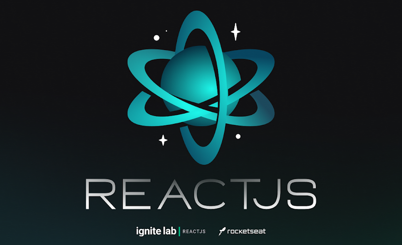

<p align="center">
  
</p>

<p align="center">
  <a href="#execution">Preview</a>&nbsp;&nbsp;&nbsp;|&nbsp;&nbsp;&nbsp;  
  <a href="#technologies">Technologies Used</a>&nbsp;&nbsp;&nbsp;|&nbsp;&nbsp;&nbsp;
  <a href="#run">How to run the project</a>&nbsp;&nbsp;&nbsp;|&nbsp;&nbsp;&nbsp;
  <a href="#contribute">How to contribute</a>&nbsp;&nbsp;&nbsp;|&nbsp;&nbsp;&nbsp;
  <a href="#license">License</a>
</p>

<p align="center">
 

  

  
</p>

<br>

## :books: About

<p align="justify">
A video content platform.

The application was developed by [Rocketseat](https://rocketseat.com.br/) during Ignite Lab | ReactJS.

</p>

<a id="execution"></a><br>

## :tv: Preview

<br>

Acesse [online](https://event-platform-eosin-rho.vercel.app/)

<br>


<br>

<a id="technologies"></a><br>

## ⚒️ Technologies Used

- Jest
- Vite
- Axios
- Vercel
- GraphQL
- ReactJS
- GraphCMS
- Typescript
- Tailwind CSS
- Apollo Client

<a id="run"></a><br>

## 🚀 How to run the project

- Clone this repository

```
git clone https://github.com/RuthMaria/event-platform.git
```

- Install dependencies

```
npm install
```

- Run the project

```
npm run dev
```

- Type the URL in the browser

```
https://localhost:3000
```

<br>

<a id="contribute"></a><br>

## 🎯 How to contribute

- Fork this repository,
- Create a branch with your feature: `git checkout -b my-feature`
- Commit your changes: `git commit -m 'feat: My new feature'`
- Push your branch: `git push origin my-feature`

<a id="license"></a><br>

## :memo: License

This project is under the MIT license. See the file [LICENSE](LICENSE.md) for more details.

---

<h4 align="center">
    Developed with ❤️ by <a href="https://www.linkedin.com/in/ruth-maria-9b256071/" target="_blank">Ruth Maria</a>
</h4>
